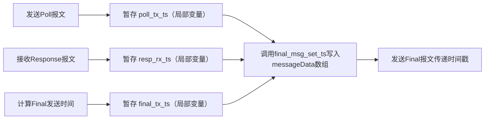
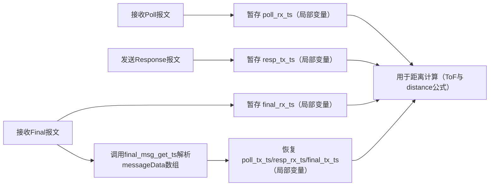
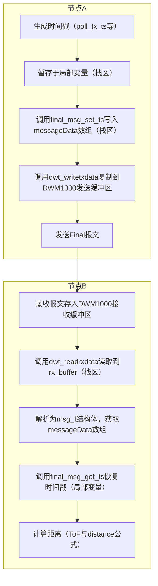

[TWR测距中节点时间戳与msg_f_send.messageData[]存储汇总.md](https://github.com/user-attachments/files/24397006/TWR.msg_f_send.messageData.md)
# TWR测距中节点时间戳与msg_f_send.messageData[]存储汇总

基于 UWB DWM1000 开源项目框架，从 “节点 A/B 时间戳存储” 和 “`msg_f_send.messageData[]`数组存储” 两大核心维度，整合关键技术细节如下：

## 一、节点 A/B 发送 / 接收时间戳的存储位置

节点在 TWR 三次报文交互（Poll-Response-Final）中产生的时间戳，通过 “局部变量暂存” 和 “报文结构体传输” 实现全流程存储，具体如下：

### 1. 核心存储载体

#### （1）临时存储：函数内局部变量

时间戳生成后首先存入**函数内局部变量**（`uint64_t`类型，避免时钟溢出），用于后续计算或打包，变量对应场景如下表：

|时间戳变量|所属节点|产生场景|存储来源|
|---|---|---|---|
|`poll_tx_ts`|A|发送 Poll 报文后|`get_tx_timestamp_u64()`（读取发送寄存器）|
|`resp_rx_ts`|A|接收 Response 报文后|`get_rx_timestamp_u64()`（读取接收寄存器）|
|`final_tx_ts`|A|计算 Final 报文发送时间后（代码第 14 行）|基于`dwt_readsystimestamphi32()`计算|
|`poll_rx_ts`|B|接收 Poll 报文后（代码第 3 行）|`get_rx_timestamp_u64()`（读取接收寄存器）|
|`resp_tx_ts`|B|发送 Response 报文后|`get_tx_timestamp_u64()`（读取发送寄存器）|
|`final_rx_ts`|B|接收 Final 报文后（代码第 5 行）|`get_rx_timestamp_u64()`（读取接收寄存器）|
#### （2）跨节点传输：`msg_f_send`报文结构体

节点 A 需将自身 3 个关键时间戳（`poll_tx_ts`/`resp_rx_ts`/`final_tx_ts`）传递给节点 B，通过 \*\*`msg_f_send.messageData[]`数组 \*\* 打包存储，核心代码如下（文档第 18-20 行）：

```Plain Text

```

- 数组索引：通过宏定义（如`FINAL_MSG_POLL_TX_TS_IDX`）区分不同时间戳，确保解析时对应正确；

- 数据格式：`final_msg_set_ts()`函数将 64 位时间戳拆分为 8 字节流（适配`messageData[]`的`uint8_t`类型）。

### 2. 节点 A/B 存储流程拆解

#### （1）节点 A 存储逻辑


#### （2）节点 B 存储逻辑


### 3. 关键补充说明

- 硬件支撑：`get_tx_timestamp_u64()`/`get_rx_timestamp_u64()`实际读取 DWM1000 芯片的**发送 / 接收时间戳寄存器**，确保时间戳精度；

- 生命周期：局部变量仅在当前报文处理函数内有效（函数结束后栈区释放），数组存储的时间戳随报文传输至节点 B；

- 数据安全：节点 A 需在局部变量释放前完成`messageData[]`打包与发送（文档中 “写入后立即调用`dwt_writetxdata()`”），避免数据丢失。

## 二、msg_f_send.messageData [] 数组的数据存储解析

`messageData[]`是`msg_f_send`结构体的核心成员（`uint8_t`类型数组），用于存储 UWB 报文有效载荷（含时间戳、报文标识等），其存储位置随数据流转分三阶段变化：

### 1. 核心确认：时间戳确实存储于数组

结合文档代码（第 18-20 行），`final_msg_set_ts()`函数的核心作用是将节点 A 的 3 个时间戳拆分为字节流，写入`messageData[]`指定索引，与报文标识（如 Final 报文的`'F'`）共同构成完整报文，代码佐证如下：

```Plain Text

```

### 2. 分阶段存储位置

#### （1）阶段 1：本地暂存（节点 A 发送前）—— 内存栈区

- 存储区域：`msg_f_send`是节点 A 报文处理函数的**局部结构体变量**，因此`messageData[]`随结构体一同存储在**内存栈区**；

- 特点：读写速度快（CPU 直接管理），生命周期与函数一致（函数结束后自动释放），适配 “临时存储 - 快速发送” 需求；

- 文档支撑：节点 A 发送前直接传递`msg_f_send`地址（`dwt_writetxdata(psduLength, (uint8 *)&msg_f_send, 0)`），说明数组此时仍在栈区。

#### （2）阶段 2：发送准备（节点 A 发送时）—— DWM1000 发送缓冲区

- 存储转移：调用`dwt_writetxdata()`函数（文档第 21 行）后，`messageData[]`的数据被**复制到 DWM1000 芯片内部的发送缓冲区**（硬件 RAM 区域）；

- 原理：DWM1000 需先缓存待发送数据，再由硬件完成射频调制与时序控制，缓冲区大小需匹配芯片最大 PSDU 长度（通常≥1023 字节）；

- 数据冗余：此时存在 “栈区原数据” 和 “芯片缓冲区副本”，栈区数据后续释放不影响发送（缓冲区数据由硬件处理）。

#### （3）阶段 3：跨节点接收（节点 B 接收后）—— 芯片接收缓冲区→节点 B 栈区

- 节点 B 接收时：Final 报文通过 UWB 射频信号被节点 B 的 DWM1000 接收，首先存储在芯片**接收缓冲区**（避免 MCU 处理不及时丢失数据）；

- 节点 B 解析时：调用`dwt_readrxdata()`函数（文档第 1 行）将接收缓冲区数据读取到节点 B 的**局部数组**`rx_buffer`（栈区），再通过`msg_f = (srd_msg_dsss*)rx_buffer`强制转换为结构体指针，此时`messageData[]`随`msg_f`存储在节点 B 栈区，供`final_msg_get_ts()`解析。

### 3. 补充细节

- 数组容量：长度由`msg_f_send`结构体定义（文档中至少 25 字节：1 字节标识 + 3×8 字节时间戳），需小于 DWM1000 最大 PSDU 长度；

- 解析逻辑：节点 B 通过`final_msg_get_ts()`将`messageData[]`的 8 字节流重组为 64 位时间戳（与`final_msg_set_ts()`的拆分逻辑对应）；

- 常见问题：若数组长度不足，会导致时间戳存储截断，进而引发距离计算错误（需确保结构体定义匹配时间戳 + 标识的总字节数）。

## 三、汇总关联：时间戳与数组的核心交互


> （注：文档部分内容可能由 AI 生成）
